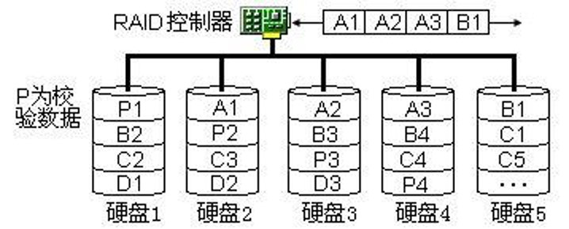

# 网络工程设计复习
## 1 网络工程概念
### 1.1 网络工程概念
> 计算机网络工程是为了达到一定的目标，根据相关的规范，通过详细地规划，按照可行的方案，将计算机网络的技术、系统、管理高效地集成到一起的工程。

#### 网络工程“生命周期”的内涵
> 借用生物存活期内的发展和演变过程来描述“网络工程”，从酝酿到建设、使用，再到维护升级，直至最终失去使用价值而完成其历史使命的过程。

#### 网络工程“生命周期”阶段划分
1) 筹备
2) 设计
3) 实施
4) 使用与维护

> 计算机网络工程有关方案主要有三个：可行性论证方案（报告），总体技术（设计）方案，实施方案

### 1.2 网络工程基本特征
#### 网络系统集成的任务
* 系统集成 = 网络系统 + 硬件系统 + 软件系统
> 系统集成工作的任务主要有两项：方案的精心设计和系统的高效实施。
> 技术集成：根据用户需求的特点，结合网络技术发展的变化，合理选择所采用的各项技术，为用户提供解决方案和网络系统设计方案。
> 应用集成：面向不同的行业，为用户的各种应用需求提供一体化的解决方案，并付诸实施。

### 1.3 网络工程设计规范
#### 制定网络标准的目的
1) 保障硬件设备之间的兼容性
2) 保障应用软件之间的数据交换
3) 保障不同产品、服务达到公认的规定品质
4) 保护标准制定者的利益
5) 降低系统集成商和用户的成本

#### 网络设计标准
* ITU-T(国际电信联盟)
* IEEE(国际电子电气工程师协会)
* IETF(国际因特网工程组)

#### 三大标准的特点
* ITU-T标准关注城域网物理层定义
* IEEE标准关注局域网物理层和数据链路层
* IETF标准注重数据链路层以上的规范

> IEEE 802 标准系列是由IEEE指定的关于LAN和MAN的标准
### 1.4 网络通信体系结构
网络的功能分层与各层通信协议的集合称为网络体系结构

#### 物联网
基本特征
* 互联网特征，联网的物品能够实现互联互通
* 识别与通信特征，“物体”具备自动识别与物物通信功能
* 智能化特征，网络系统具有自动化，自我反馈与智能控制的特点。

物联网整体结构可以分为3个层次：
* 感知层
* 传送层
* 应用层

云计算最关键的技术是虚拟化

#### SDN 软件定义网络
* 控制层和数据层的解耦：虽然控制层和数据层解耦了，但是控制层可以通过接口来控制数据层转发数据
* 逻辑上集中控制
* 将底层的网络资源从应用中抽象出来

#### 1.5 网络工程设计分析
简单设计原则: 怎样解决网络系统中的大问题复杂性
> 网络规模越大，涉及的约束条件越多，所耗费的资源越多。问题的大小与复杂性直接相关。例如：对以太局域网来说，100个用户的网络设计是一个小问题，而10万个用户的城域以太网设计则是一个大问题
> 笛卡尔《方法论》：将大问题分解为多个规模适当的小问题，然后再进行解决。
> 有些问题需要采用“系统论”的方法来解决。

## 2 用户需求分析
### 2.1 需求分析基本方法
#### IEEE软件工程定义的需求
1) 用户解决问题或达到目标所需要的条件或要求
2) 系统满足合同、标准、规范或其它正式规定文档所需具有的条件或要求
3) 反映上面1）或2）所描述的条件或要求的文档说明

#### 用户网络应用环境
1) 用户建筑物布局情况，建筑物之间的最大距离
2) 外部网络接入点
3) 用户确定的网络中心机房位置
4) 用户设备间的位置及电源供应情况
5) 用户信息点数量及位置
6) 任何两个用户之间的最大距离
7) 用户部门分布情况
8) 特殊需求或限制条件

#### 用户的特点
1) 用户是经过筛选的：用户的需求存在千差万别，有些需求甚至相互矛盾
2) 用户是沉默的：用户往往难以清楚地描述具体需求
3) 用户是难以满足的
4) 用户是可引导的

### 2.2 基本要求需求分析
* 四大基本服务：DNS、Web、Email、FTP
* 小型局域网一般采用星形拓扑结构
* 园区网一般采用树形结构加网状结构
* 城域网一般采用环形、树形等结构

### 2.3 高级要求需求分析
#### 网络扩展应满足的条件
1) 用户或部门能够简单的接入现有网络
2) 新应用能够无缝地在现有网络上运行
3) 现有网络拓扑结构无需作大的更改
4) 原设备能够得到很好的利用
5) 网络性能恶化在用户允许范围内

#### 导致产生不合格的用户需求说明的场景
1) 没有足够多的用户参与
2) 用户需求不断增加
3) 模棱两可的需求
4) 不必要的特性
5) 过于精简的需求说明
6) 忽略了用户分类
7) 不准确的计划

#### 当用户对需求分析报告不满意时
1) 反思网络设计工程师是否站在用户立场考虑问题；
2) 网络设计工程师与用户对网络业务存在不同理解
3) 是否为非技术因素

## 3 网络结构设计
### 3.1 点对点传输网络
* 主机以点对点方式连接
* 主机通过单独的链路进行数据传输
* 两个节点之间可能会有多条单独的链路
* 点对点网络主要用于城域网和广域网
* 点对点形、链路形、环形、网状形等
#### 点对点网络的优缺点
* 优点：网络性能不会随着数据流量加大而降低
* 缺点：网络中任意两个节点通信时，如果它们之间的中间节点较多，就需要经过多跳后才能到达，这加大了网络传输时延

### 3.2 广播传输网络
#### 广播网络信号传输方式
* 单播
* 多播
* 组播
#### 冲突域
* 冲突域的大小会影响到网络的性能
* 交换机、路由器等设备可以隔离冲突域
#### 广播域
* 大量无用的广播包会形成广播风暴
* 可以用路由器来分割广播域
* 可采用VLAN划分缩小广播域的范围
#### 在网络设计中控制冲突域的方法
> 使网段中的主机数量尽量最小化
#### 造成交换式网络产生广播风暴的主要原因
1) 主机查找服务器
2) 大量主机广播式查找服务器地址
3) 网络环路
4) 网卡故障
5) 网络病毒
6) 黑客软件和视频软件使用
#### 星形网络结构
* 每个节点都有一条单独的链路与中心节点相连，所有数据都要通过中心节点进行交换
* 星形网络采用广播传输技术，中心节点设备通常采用交换机
* 星形以太网在物理上呈星形结构，但逻辑上任然是总线形拓扑结构，但逻辑上仍然是总线形拓扑结构
* 星形结构简单便宜，但可靠性较低，中心节点负担重。
#### 蜂窝网络结构
* 主要用于无线通信网络
* 蜂窝大小与基站或AP发射功率有关
* 蜂窝结构采用频率复用技术进行扩容
* 网络建设时间短，易于扩展，但信号容易受到环境或人为的干扰，速率低，成本高。
#### 混合网络结构
* 主要出现在城域网和广域网中
* 由交换机连接构成的树形结构（星形+星形）
* 混合结构的顶层节点负荷较重
#### 环形网络
##### 优点
* 不需要集中设备（如交换机），消除了对中心系统的依赖性
* 信号沿环单向传输，传输时延固定
* 所需光缆较少，适宜长距离传输
* 各个节点负载较为均衡
* 双环或多环网络具有自愈功能
* 可实现动态路由
* 路径选择简单，不容易发生地址冲突等问题
###### 缺点
* 不适用与多用户接入
* 增加节点时，会导致路由跳数增加
* 难以进行故障诊断
* 结构发生变化时，需要重新配置整个环网
* 投资成本较高
### 3.3 网络设计模型
#### 层次化模型
* 核心层：核心层提供核心节点之间的高速数据转发
* 汇聚层：汇聚层主要负责路由聚合，收敛数据流量
* 接入层：接入层为用户提供网络访问和管理功能

### 3.4 网络结构设计
#### 服务子网结构设计
##### 服务局域网类型
* 通用服务：DNS、Web、FTP等
* 应用服务：CAD、OA、MIS
* 服务子网在网络的层次对网络性能影响很大
* 设计原则：网络服务集中，应用服务分散

##### VLAN的设计原则
1) VLAN的安全与性能，不应当依赖VLAN作为安全设备
2) VLAN应用到广域网的可能性，将VLAN扩展到WAN上是不明智的
3) VLAN之间的相互受影响，同一交换机不同VLAN共享交换机时，会争夺交换机的CPU和背板资源
4) VLAN设计的基本原则：（1）应尽量避免在同一交换机中配置太多的VLAN。（2）VLAN不要跨越核心交换机和拓扑结构的分层。

##### TCP/IP模型与分层设计模型的区别
1) TCP/IP模型针对通信行为进行定义，分层模型针对拓扑结构进行规范
2) TCP/IP为强制性标准，分层为行业规范
3) TCP/IP应用于原理说明，分层应用于工程设计
4) TCP/IP层次之间有明确的接口规范，分层模型层次之间没有明确的物理和逻辑界限。

## 4 网络路由技术
### 4.1 网络地址规划
#### 地址类型与分配
* 由于分配不合理，目前可用的IPv4地址已经分配完毕
* IETF提出的IP地址不足解决方案：
> 标准地址 特殊地址
> CIDR VLSM
> NAT
> IPv6

某网段分配为：222.210.100.01/26，写出他的掩码和最大主机数
> 掩码为26位，即IP地址前26位全部变成1，即255.255.255.193
> 最大主机数是2的[32-26=6]次方，然后减2，即64-2=62

* NAT技术有哪些功能
1) 解决IP地址紧缺问题
2) 隐藏内网地址
3) 对网络进行负载均衡控制
4) 

### 4.2 静态路由技术
#### 静态路由技术
* 静态路由按网络工程师设计的路由进行路由选择
* 静态路由一般用于小型局域网
* 静态路由采用手工方法在路由器中设置路由信息
* 优点：网络安全性高，不占用网络带宽
* 缺点：网络管理员难以全面了解整个网络的结构
* 网络结构调整时，工作难度和复杂度非常高
#### 动态路由技术
##### 基本功能
* 路由器自动维护内部路由表
* 在路由器之间交换路由信息
##### 动态路由协议
* 距离向量路由协议（RIP）
* 链路状态路由协议（OSPF）
* 中间系统-中间系统（IS-IS）
* 分级路由协议（BGP）
* 园区网和城域网采用OSPF路由协议居多
* 广域网通常采用BGP
##### 路由配置的基本思路
1) 将网络需求具体化。如：哪些地方需要路由，哪些地方采用3层交换机，子网如何划分等
2) 绘制简化的网络结构图，标注网络地址，标注接口类型，接口IP地址等
3) 配置步骤：
    * 进入规定的配置模式
    * 选择配置端口
    * 配置地址
    * 配置协议与参数
    * 激活配置
    * 查看配置
    * 测试配置
    * 保存配置

### 4.3 OSPF动态路由
#### OSPF的区域结构
> 在一个OSPF网络中，可以将AS（自治系统）分为主干区域和标准区域。在一个AS中，只能有一个主干区域，它的区域号为0（如Area0），但是可以有多个标准区域。区域号是一个32位的标识号
> OSPF的区域号与自治系统的AS号不同，AS必须申请获得；而OSPF区域号有网络工程师命名。
#### OSPF协议工作原理
* 在自治系统中，每一台运行OSPF协议的路由器，通过Hello呼叫协议，收集各自接口和邻居路由器的链路状态信息；
* 然后通过泛洪算法在整个系统中广播自己的LSA
* 生成最短路径树
* 确定完整路由

### 4.4 BGP动态路由
#### BGP路由工作原理
* BGP运行在ISP路由器与用户网络边界路由器之间，BGP负责各个AS之间的路由与协调
* BGP用于在AS之间传递路由信息
* 在BGP看来，整个Internet就是一个AS图
* BGP是一种路径矢量路由协议，它属于外部网关协议（EGP）

## 5 网络性能设计
### 5.1 网络带宽分析与设计
#### 网络带宽
* 基带网中，带宽用于衡量数据传输速率
* 视频是网络带宽的主要占有者
* 影响网络带宽的主要因素
    > 网络带宽与网络设备、网络线路、网络类型、网络环境等因素有关
* 频带网络的带宽与基带网络的带宽的区别：
    > 信源发出的没有经过调制的原始电信号所固有的频带，称为基本频带，简称基带。
    基带和频带相对应，频带：对基带信号调制后所占用的频率带宽。

### 5.2 网络流量分析与设计
#### 网络流量基本特征
* 网络流量与网络带宽的区别
    1) 带宽是一个固定值，流量是一个变化量
    2) 带宽由网络工程师规划分配，有很强的规律性
    3) 流量由用户网络业务形成，规律性不强
    4) 带宽与设备、传输链路相关；网络流量与使用情况、传输协议、链路状态等因素相关。

### 5.3 服务质量分析与设计
#### QoS技术指标
* Qos提供端到端的服务质量控制或保证
* 技术指标
    1) 传输时延
    2) 时延抖动
    3) 丢包率
    4) 吞吐量
* 某用户平均每天上网为4小时，如果用户每天花费60%的时间浏览50个网页，40%的时间下载文件，试计算用户占用Web服务器和FTP服务器的有效工作时间。
    > (1) 如果一个用户每天浏览50个网页，Web服务器为该用户提供服务的有效时间是：
    Web有效时间 = 打开网页数×（网页大小[KB]+系统开销）/[端到端的链路带宽[Kbit/s]/8]
    = 50×(30+30×10%)/[200/8]= 66s = 1min
    (2) FTP服务器的有效工作时间：4h × 40% = 1.6h 

### 5.4 负载均衡分析与设计
#### 为什么说全球网络按非阻塞式设计没有意义
1) 投入大，产出小
2) 没有考虑集线比
3) 不符合“奥卡姆剃刀”原则

## 6 网络可靠性设计
### 6.1 可靠性设计概述
#### 网络可用性分析
* 可用性是衡量网络系统提供持续服务的能力
* 系统可用性计算方法：
    > 系统可用性 = 系统运行时间/（系统运行时间+系统停机时间）× 100%
* 网络最重要的两个特性是速度和可靠性
#### 网络可用性计算
##### 串联型网络
* 在串联网络中，可用性最差的单元对系统的可用性影响最大
* $$R_s = \prod_{i = 1}^{n}R_{i}$$
##### 并联型网络
* $$R_s = 1-\prod_{i = 1}^{n}(1-R_{i})$$
* 网络拓扑结构如下所示，计算路由器ABCD整体的可用性
  
* 路由器ABC之间的可用性=0.99×0.97×0.98=94.1%
* 路由器B+D并联体的可用性=1-（1-路由器B的可用性）×（1-路由器D的可用性）=1-（1-0.97）×（1-0.95）=99.85%
* 路由器ABCD整体可用性= A可用性×（B+D可用性）×（C可用性）
=0.99×0.9985×0.98=96.9%
#### 提高网络可靠性的技术
> 一些网络设备采用不间断转发技术；在网络结构设计中，存储网络系统、高可用性集群网络系统和容灾备份网络系统等
### 6.2 网络冗余设计
#### 冗余设计的目的
* 提供网络链路备份
* 提供网络均衡负载
* 链路备份和负载均衡在结构上完全一致，但是完成的功能不同，工作模式也不同。
#### 冗余设计的内容
* 链路冗余
* 设备冗余
* 软件冗余

### 6.3 存储网络设计
#### 磁盘阵列技术RAID
* 独立冗余磁盘阵列技术
##### RAID类型
* 软件RAID
* 硬件RAID
##### RAID0
* RAID0采用无数据冗余的存储空间条带化，具有成本低、读写性能极高等特点。
  
##### RAID1
* RAID1采用两块硬盘数据完全镜像的技术，保证了数据的冗余。
  
##### RAID5
* RAID5分布式奇偶检验磁盘阵列，将校验数据块以循环的方式放在磁盘阵列的每一个磁盘中。
  
##### RAID模式下磁盘空间利用情况

#### FC存储网络设计
* 光纤通道FC是一种数据传输接口技术
* FC采用全双工串行通信方式，支持点对点、仲裁环和交换式三种拓扑结构。
* 由FC组成的网络不同于以太网技术，它的带宽资源几乎全部可用于传输数字信号，FC网络基本上没有管理信息。
* FC技术有三种光纤信道交换方法。
    1) 主控制器交换模式
    2) 网络交换模式
#### IP存储网络
* IP存储目前的主流技术是iSCSI
* 其它IP存储技术包括有iFCP，FCIP等。
#### 网络存储技术的类型和应用
1) 直接附加存储（DAS），DAS是直接连接在服务器主机上的存储设备。如硬盘、光盘、USB存储器等设备。
2) 网络附加存储（NAS），NAS最典型的产品是专用磁盘阵列主机、磁带库等设备
3) 存储区域网络（SAN），在服务器和存储设备之间利用专用的光纤通道连接的网络系统
4) JBOD存储技术
### 6.4 集群系统设计
#### 计算机集群系统类型
* 集群系统是将2台以上的计算机（如PC服务器），通过软件（如Rose HA）和网络（如以太网与RS-232），将不同的设备（如磁盘阵列）连接在一起，组成一个高可用的超级计算机群组，协同完成大型计算任务。
* 集群是目前超级计算机的主流体系结构。
* 高可用集群，负载均衡集群、高性能计算集群
#### 利用软件进行数据自动备份和RAID1备份有什么不同
> RAID1通过磁盘数据镜像实现数据冗余，在成对的独立磁盘上产生互为备份的数据。当原始数据繁忙时，可直接从镜像拷贝中读取数据，因此RAID1可以提高读取性能。RAID1是磁盘阵列中单位成本最高的，但提供了很高的数据安全性和可用性。当一个磁盘失效时，系统可以自动切换到镜像磁盘上读写，而不需要重组失效的数据
> 传统的数据备份主要采用内置或外置的磁带机进行冷备份。但是这种方式只能防止操作失误等人为故障，而且其恢复时间也很长。

## 7 网络安全设计
### 7.1 网络安全体系与技术
#### 网络安全体系结构
##### IATF（信息保障技术框架）标准
* IATF标准理论：深度保护战略
* IATF标准三个核心原则：人、技术和操作
* 四个信息安全保障领域：保护网络和基础设施，保护边界，保护计算环境，保护支撑基础设施

### 7.2 防火墙与DMZ设计
#### 防火墙的类型
* 硬件防火墙
* 软件防火墙
* 硬件防火墙在功能和性能上都优于软件防火墙，但是成本较高。
#### 防火墙的不足
* 不能防范不经过防火墙的攻击。
* 不能防范恶意的知情者。
* 不能防范内部用户误操作造成的威胁。
* 不能防止受病毒感染的软件或木马文件的传输。
* 防火墙不检测数据包的内容，因此不能防止数据驱动式的攻击。
* 不安全的防火墙、配置不合理的防火墙、防火墙在网络中的位置不当等，会使防火墙形同虚设。
#### DMZ基本功能
* DMZ设立在非安全系统与安全系统之间的缓冲区
* DMZ的目的是将敏感的内部网络和提供外部访问服务的网络分离开，为网络提供深度防御。
#### DMZ的设计基本原则
> 1) 设计最小权限，例如定义允许访问的网络资源和网络的安全级别
> 2) 确定可信用户和可信任区域
> 3) 明确各个网络之间的访问关系

### 7.3 网络安全设计技术
#### IDS网络安全设计
* IDS（入侵检测系统）
* IDS分为实时入侵检测和事后入侵检测。
* 实时入侵检测在网络连接过程中进行，IDS发现入侵迹象立即断开入侵者与主机的连接，实施数据恢复
* 事后入侵检测由网络管理人员定期或不定期进行。
#### IDS常用检测方法
* 特征检测、统计检测与专家系统。
#### IPS网络安全设计
* IPS（入侵防御系统）
* IPS不但能检测入侵，而且能实时终止入侵行为。
* IDS设备在网络中采用旁路式连接；
* IPS在网络中采用串接式连接。
#### VPN网络安全设计
* 定义：使用IP机制仿真出一个私有的广域网。
* VPN通过私有隧道技术，在公共数据网络上仿真一条点到点的专线。
#### VPN隧道技术工作原理
* 隧道是一种数据加密传输技术
* 数据包通过隧道进行安全传输。
* 被封装的数据包在隧道的两个端点之间通过Internet进行路由。
* 被封装的数据包在公共互联网上传递时所经过的逻辑路径称为隧道。
* 数据包一旦到达隧道终点，将被解包并转发到最终目的主机。
#### VPN工作协议
* PPTP（点到点隧道协议）
* L2TP（第二层隧道协议）
### 7.4 网络物理隔离设计
#### 物理隔离技术
> 根据国家规定：设计国家秘密的计算机信息系统，不得直接或者间接地与国际互联网或其他公共信息网络相连接，必须实行物理隔离。
#### 隔离网闸工作原理
> GAP（安全隔离网闸）通过专用硬件和软件技术，使两个或者两个以上的网络在不连通的情况下，实现数据安全传输和资源共享。
#### GAP技术的特点
* GAP由固态读写开关和存储介质系统组成
* GAP在同一时刻只有一个网络与安全隔离网闸建立无协议的数据连接。
* GAP没有网络连接，并将通信协议全部剥离。数据文件以原始数据方式进行“摆渡”，因此，它能够抵御互联网绝大部分攻击。

## 8 光纤通信工程
### 光纤通信的基本原理
> 光纤中无光信号为0码，有光信号则为1码。
### 光纤通信的优点和缺点
* 优点：通信容量大，保密性好，抗电磁波辐射干扰，防雷击，传输距离长
* 缺点：光纤连接困难，成本较高
### 光纤通信的波长范围和工作窗口
* 光纤通信工作波长范围为850~1550nm
* 在波长为850nm、1310nm和1550nm处，有3个损耗很小的波长“窗口”
### 光纤通信有哪些器件
* 光发射机
* 光缆
* 光中继器
* 光接收机
### 光纤通信的最大理论容量
* 如果采用0.4nm（50GHz）的波长间隔进行DWDM通信，大约能安排500个波长，如果每个波长最大传输速率为40Gbit/s，则单根光纤的通信容量理论上可以达到20Tbit/s（500×40）左右。
### 多模光纤与单模光纤的差别
* 传输多路径光波的光纤称为多模光纤（MMF）
* 当光纤纤芯尺寸与光波波长大致相同时，如纤芯直径在5～10μm时，光波在光纤中以一种模式传播，这种光纤称为单模光纤。
* 单模光纤具有极大的传输带宽，特别适用于大容量和长距离的通信系统。

## 9 综合布线设计
### 交换机的主要技术参数
* 端口数量
* 端口类型
* 端口传输速率
* 背板带宽
* 包转发速率
* MAC地址表大小
* 工作层
* 数据转发模式
* 网络管理
### 计算机集群系统
> 集群技术将多台相互独立的计算机（大多采用PC服务器），通过高速网络组成一个完整的服务器系统，并以单一系统的模式加以管理，使多台服务器像一台机器一样工作。
### 管道和线槽布放线缆的数量计算
* 管道、线槽、桥架布线时，截面积利用率按下式计算：
* 截面积利用率 = 管道截面积/线缆截面积
* 管道内布放线缆的数量按下式计算：
  * $$n =  INT[\frac{管道内截面积}{缆线面积}×K]$$
  * 式中：n为管道中布放线缆根数；INT为取整函数；K为截面积利用率。
* 工程实践证明，截面积利用率为30%较好
### 双绞线材料用量预算
#### 楼层双绞线平均长度预算
* 楼层线缆平均长度计算如下：
  * $$L = [(\frac{A+B}{2})+6]×1.1$$
  * 式中，L为楼层线缆平均长度（m）；A为离楼层配线架最远插座的布线长度（m）；B为离楼层配线架最近插座的布线长度（m）；6为端接余量（m）；1.1为预留10%的布线长度
#### 楼层双绞线箱数
* 每层双绞线总长度为305m，布线工程需要的双绞线数量按下式计算：
  * $$K = INT[\frac{n×L}{305}]+1$$
  * 式中，K为楼层线缆总数（箱），INT为取整函数，n为楼层信息点总数，L为线缆平均长度（m），305为1箱线缆的总长度（m）；1为备用线缆箱数

#### 水晶接头用量预算
* RJ45水晶接头的需求量可按下式估算：
  * $$m=n×4+n×4×0.15$$
  * 式中，m为RJ45水晶接头总需求量，n为信息点总数，0.15为15%的工程余量
#### 信息模块用量估算
* 工作区信息模块的需求按下式计算：
  * $$m=n+n×0.03$$
  * 式中，m为信息模块总需求量，n为信息点总数，0.03为3%的工程余量

#### 案例
> 用户需求平均每层楼布数据点40个和语音点40个；水平线缆从楼道吊顶的天花板上利用桥架走线；每楼层设管理间一个，靠近建筑弱电井；各信息点到楼层管理间子系统水平线缆最长为50m，最短为10m；数据系统和语音系统均采用超5类铜缆。根据以上要求，计算：每楼层需要的超信息模块数，每楼层需要的RJ45水晶接头数，每楼层需要的超5类电缆箱数。
> 每楼层需要:
> * 超5类信息模块41个（40+40×3%）
> * 3类语音模块41个（40+40×3%）
> * 2口墙上型信息面板为41个（40+40×3%）
> 每楼层需要:
> RJ45水晶接头184个（40×4+40×4×15%）
> RJ11水晶接头184个（40×4+40×4×15%）
> 楼层超5类水平电缆的平均长度为：
> * L=((50+10)/2)+6)×1.1=39.6（m）
> 1层楼需要的电缆箱数：
> * K=INT（40×39.6/305）+1=6（箱）

### UPS(不间断电源系统)
* 功能：确保负载供电的不间断，并将市电中各种干扰与负载彻底隔离。
* 在线式（双变换UPS）和后备式。
#### UPS负载功率计算
* 一般以最大负载功率为基准计算UPS负载。
* 网络设备功率单位转换方法如下：
  * 网络设备功率值（VA）=网络设备功率值（W）÷0.8
* 如果网络设备标注为电流，则功率值为：
  * 网络设备功率（VA）=网络设备电流（A）×220
* UPS的负载功率为所有接入UPS设备的VA值之和，再加上20～30%的负载余量。

## 判断题
1) 城域IP网络可以采用与局域网大体相同的技术，也可能采用与局域网完全不同的技术。（√）
2) 在指定标准的过程中，用户的作用非常明显。（×）
3) 网络备份和负载均衡在冗余设计的物理结构上完全一致，但是完成的功能完全不同。（√）
4) 同一个VLAN之中的主机通信必须通过路由器进行信号转发。（×）
5) 解决死锁的一种方法是先让它发生，然后再处理它。（√）
6) 在SDH传输网络，每个节点由TM构成。（×）
7) DWDM是一种纯粹的物理层技术，它完全独立于所携带信息的类型。（√）
8) 数据业务对时延抖动不敏感，如果路由器需要支持语音、视频等业务，这个指标才有测试的必要。（√）
9) 如果可能就路由，只在需要时才交换，这是网络设计中一个基本原则。（×）
10) 服务器群集技术成为服务器的主流。（√）
11) 网络设计涉及到的标准核心是RFC和IEEE两大系列。（×）
12) 第2层交换机是不转发广播的，所以不能分割广播域。（×）
13) 可以采用VLAN划分的方法缩小广播域的范围。（√）
14) 环网的路径选择非常简单，不容易发生网络地址冲突等问题。（√）
15) 局域网信号传输时延大，且误码率较高。（×）
16) IEEE 802标准系列是由IEEE制定的关于LAN和MAN的标准。（√）
17) 冲突是网络运行时一个正常的组成部分。（√）
18) 环形结构的网络是一种点对点链路。（√）
19) 解决死锁的方法时不让它发生。（×）
20) 广域网可以采用与局域网完全不同的技术，也可以采用局域网技术。（×）
21) 由于光纤模块没有堆叠能力，因此光纤只能采用级联模式。（√）
22) FC虽然具备一些网络互联的功能，但远不是一个完整的网络系统。（√）
23) iSCSI和光纤通道之间是兼容的。（×）
24) H.323和SIP两大协议互不相容。（√）
25) LMDS不支持移动通信业务，只能提供定点接入。（√）
26) IPS能检测入侵的发生，但是不能实时终止入侵行为。（×）
27) 物理隔离产品在理论和实践上要比防火墙低一个安全级别。（×）
28) 以太网交换机的每一个端口相当于一个网桥。（√）
29) 近端串扰是双绞线中，一对线对另一对线的干扰信号。（√）
30) 在标准或规范的制定中，厂商和用户都有共同的看法。（×）
31) 接入层交换机上行接口的传输速率应当比下行端口高出一个数量级。（√）
32) 链路集合的目的是保证链路负载均衡。（√）
33) 分布式服务设计模型的基本原则是应用服务集中，网络服务分散。（×）
34) 网络在设计时必须考虑最繁忙时段的信息流量，否则在这时数据就会阻塞或丢失。（√）
35) 刀片式服务器中的每一块“刀片”实际上类似于一个独立的服务器。（√）
36) SMP技术对于I/O处理繁忙的服务效果显著。（×）
37) 实验证明，在40m距离检测到的近端串干扰较真实。（√）
38) 目前因特网是基于提供“尽力而为”的服务的IP网络。（√）
39) 单模光纤不存在模式色散问题。（√） 
40) 广播式网络主要用于局域网、城域网、广域网中。（×）